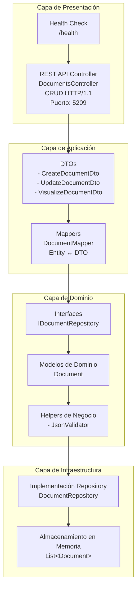

# insightflow-documents-service

Servicio que permite la gestión de toda la información de documentos de InsightFlow

## Tecnologías utilizadas

- **Framework:** ASP.NET Core 9.0
- **Protocolo API:** REST (HTTP/1.1)
- **Almacenamiento:** En memoria (In-Memory)
- **Control de Versiones:** Git con Conventional Commits

## Patrón Arquitectónico Principal

El Microservicio de Documentos está construido siguiendo un patrón de Arquitectura en Capas combinado con el Patrón Repository y principios de Clean Architecture. Este microservicio es responsable de gestionar la creación, lectura, actualización y eliminación de documentos dentro del ecosistema InsightFlow.



## Modelo de Datos

### Entidad Document
```
Almacenamiento: In-Memory List
├── Id (string, PK)
├── WorkspaceId (string)
├── Title (string)
├── Icon (string)
├── Content (string) - JSON format
├── CreatedByUserId (string)
├── CreatedAt (DateTime)
├── UpdatedAt (DateTime)
├── IsActive (boolean)
└── DeletedAt (DateTime?)
```

### Estados de un Documento:

- **Activo:** Documento está disponible y visible (IsActive = true).
- **Eliminado:** Documento marcado como eliminado (soft delete, IsActive = false).

### Endpoints Disponibles

| Método | Endpoint | Descripción |
|--------|----------|-------------|
| `GET` | `/api/Documents` | Obtiene la lista completa de todos los documentos activos. |
| `GET` | `/api/Documents/{id}` | Busca y retorna un documento específico por su ID único. |
| `GET` | `/api/Documents/workspace/{workspaceId}` | Obtiene todos los documentos activos de un workspace específico. |
| `POST` | `/api/Documents` | Crea un nuevo documento en el sistema. |
| `PATCH` | `/api/Documents/{id}` | Actualiza la información de un documento existente. |
| `DELETE` | `/api/Documents/{id}` | Elimina lógicamente un documento (soft delete). |
| `GET` | `/health` | Verifica el estado del servicio. |

## Instalación y Configuración para entorno local

### Prerrequisitos

- **.NET 9 SDK:** [Download](https://dotnet.microsoft.com/download/dotnet/9.0)
- **Visual Studio Code o Visual Studio 2022:** [Download](https://code.visualstudio.com/)
- **Docker (opcional):** [Download for windows](https://docs.docker.com/desktop/setup/install/windows-install/)

### Pasos de Configuración

1. **Clonar el Repositorio**:
    ```bash
    git clone https://github.com/your-org/insightflow-documents-service.git
    cd insightflow-documents-service
    cd DocumentService
    ```

2. **Configurar Variables de Entorno (Opcional)**:
    Puedes crear un archivo `.env` en la raíz del proyecto si necesitas configuraciones personalizadas:
    ```
    ASPNETCORE_ENVIRONMENT=Development
    ```

3. **Instalar Dependencias**:
    ```bash
    dotnet restore
    ```

4. **Ejecutar el Proyecto**:
    ```bash
    dotnet run
    ```
    
    El servicio estará disponible en `http://localhost:5209`

### Ejecución con Docker

1. **Construir la imagen Docker**:
    ```bash
    docker build -t insightflow-documents-service .
    ```

2. **Ejecutar el contenedor**:
    ```bash
    docker run -p 5209:8080 insightflow-documents-service
    ```

## Ejemplos de Uso

### Crear un documento

```bash
POST http://localhost:5209/api/Documents
Content-Type: application/json

{
  "workspaceId": "workspace-example-1",
  "title": "Mi Documento",
  "icon": "📄",
  "content": "{}",
  "createdByUserId": "user-123"
}
```

### Actualizar un documento

```bash
PATCH http://localhost:5209/api/Documents/{id}
Content-Type: application/json

{
  "title": "Título Actualizado",
  "icon": "📝",
  "content": "{\"blocks\":[{\"type\":\"paragraph\",\"content\":\"Nuevo contenido\"}]}"
}
```

### Obtener documentos de un workspace

```bash
GET http://localhost:5209/api/Documents/workspace/workspace-example-1
```

## Testing

Puedes probar la API usando:

- **Swagger UI**: Accede a `http://localhost:5209` después de ejecutar el servicio en modo Development
- **Postman**: Importa el archivo `DocumentsService.postman_collection.json` incluido en el repositorio
- **HTTP Client**: Usa el archivo `DocumentService.http` para probar endpoints directamente desde VS Code

## CI/CD

El proyecto incluye GitHub Actions (`.github/workflows/build-docker-image.yaml`) para:
- Construir automáticamente la imagen Docker
- Publicar la imagen en Docker Hub cuando se hace push a la rama `main`
- Etiquetar con `latest` y el SHA del commit

## Notas

⚠️ **Importante**: Este servicio utiliza **almacenamiento en memoria**. Los datos se inicializan con ejemplos al arrancar y se perderán completamente al reiniciar el servicio. Para un entorno de producción, se recomienda implementar persistencia con una base de datos (PostgreSQL, MongoDB, etc.).

## Estructura del Proyecto

```
insightflow-documents-service/
├── .github/
│   └── workflows/
│       └── build-docker-image.yaml
├── DocumentService/
│   ├── src/
│   │   ├── Controller/          # Controladores REST
│   │   ├── dtos/               # Data Transfer Objects
│   │   ├── Interface/          # Interfaces del repositorio
│   │   ├── model/              # Modelos de dominio
│   │   ├── repository/         # Implementación del repositorio
│   │   ├── helper/             # Utilidades y validadores
│   │   └── mappers/            # Mappers entre DTOs y entidades
│   ├── Properties/
│   ├── Program.cs
│   ├── appsettings.json
│   └── DocumentService.csproj
├── Dockerfile
├── .gitignore
└── README.md
```